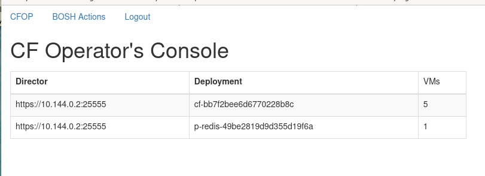

# cfopscon
The Cloud Foundry Operator's Console


The CF Operator's Console is intended to reduce toil for many common
cloud foundry operator tasks (e.g. obtaining and downloading logs).  It
operates as a cloud foundry application, but has some specific
requirements outlined below (in order to obtain appropriate access).

This repository contains the source code for the Operator's Console;
it is intended to be implemented via "cf push" on the targetted
foundation.  It provides links to common areas - BOSH is the first of
these.

The Operators Console leverages the APIs of BOSH and CF API to achieve
it's goals; as such, it must contain privileged information (see opcon.ini)
(e.g. username/password) to bootstrap OAuth2 credentials necessary to
access the appropriate APIs.

## Current Status
Common BOSH operations are supported
* retrieving logs from VMs ("bosh logs")
* VM "vitals" ("bosh vms --vitals") with restart/stop/start/recreate operations,
* Task results and controls - task cancelling, and results/debug/events logs
* Run deployment errands

While currently bosh-centric, plans include extending the model for
common cloud foundry operational tasks.  See "TO DO' for planned work.

## Deployment
The _CF Operator's Console_ is a Flask application that can be ran
from the desktop via Flask commands (assuming BOSH director access),
as well as under gunicorn to support the cf-push model of deployment.

To run from the desktop:
 ```bash
% OAUTHLIB_INSECURE_TRANSPORT=1 FLASK_APP='opcon.app:app' flask run
```
should result in a running system, accessible from localhost:5000.

Or, for more production use-cases
```bash
% gunicorn -c gunicorn.py 'opcon.app:app'
```

Or, for cloud foundry foundations
```bash
% cf push -f manifestlyml
```

## Options
Options and configuration are contained in the "opcon.ini" file.  It
is broken into 2 sections - "bosh" and "auth".

Options are specified below, with any default value indicated first.
### bosh options
- director\_url=_https:/10.100.10.10:25555_ - - the full URL for the bosh director
- verify_tls=[False, True] -- disable/enable TLS validation (meant for debugging)
- user=_admin_ -- username for the BOSH login
- pass=_magic_ -- password for the BOSH login
- debug=[False, True] -- disable/enable debugging for the director code

### auth options
  - type=MOD -- required, indicates loadable module
  - module=_module.py_ - module located in modules/ area
  - data=_mod\_specific_ - module-specific comma-seperated list
  - debug=_False_ - module-specific debugging

## Limitations
- running multiple instances of the process running doesn't work
>  The user database is an in-RAM database, so of course moving across
>  CF instances doesn't work.  An alternatives involve external K/V
>  stores, and it's not clear if usage will be such that that is worth
>  the work.

## TO DO
- add the "force" flag to the VM recreate in bosh_vitals
- improve bosh tasks/errands output collection - auto-refresh events/debug output?
- allow errand flags (e.g. specify the instance)
- remove passwords from INI file
- home page statistics -- include "interesting" stats about BOSH, CF
- Investigate and support bosh-cli-like syntax "bosh logs compute" for
  logs from all "compute" jobs.
- "flash" updates on the status of things in wait;  E.g. waiting on a
  job to complete for logs download - put a status update.
  Presumably jQuery, and use the /deployments/:deployment/instances API~~
- restart CF brokers
- ~~reauthentication timeouts need to occur for oauth/google - verify in auth/module~~
- ~~Implement authentication for access to the system (CSV, 3rd party -  e.g google)~~
- ~~user activity tracking - log who-did-what~~
- ~~recreate specific VMs~~
- ~~show VM health state (bosh vms --vitals)~~
- ~~Implement auto-fill for BOSH deployment jobs~~
- ~~add the ability to run existing bosh errands~~
- ~~from bosh_tasks - remove data-results column (that's in the main table)~~
- ~~cancel tasks~~
